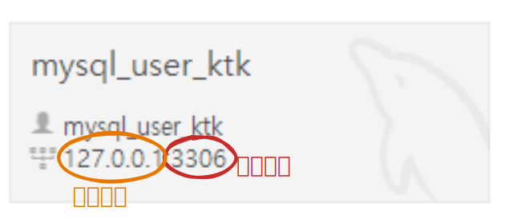
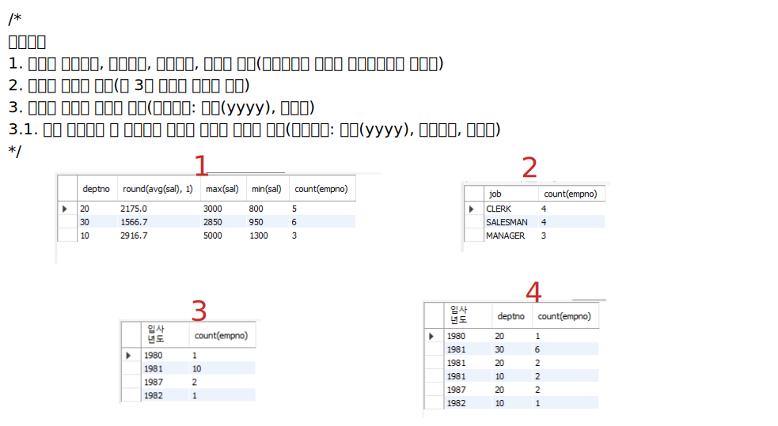

UI: User Interface\
UX: User eXprience\
IPv4: 000.000.000.000\


<details>
<summary>실습예제</summary>
<div markdown ="1">

```sql
drop table dept;
drop table emp;
drop table bonus;
drop table salgrade;

CREATE TABLE dept (
    deptno INT,
    dname VARCHAR(14),
    loc VARCHAR(13)
);


CREATE TABLE emp (
    empno INT,
    ename VARCHAR(10),
    job VARCHAR(9),
    mgr INT,
    hiredate DATE,
    sal INT,
    comm INT,
    deptno INT
);


CREATE TABLE bonus (
    ename VARCHAR(10),
    job VARCHAR(9),
    sal INT,
    comm INT
);


CREATE TABLE salgrade (
    grade INT,
    losal INT,
    hisal INT
);
    

INSERT INTO DEPT VALUES	(10,'ACCOUNTING','NEW YORK');
INSERT INTO DEPT VALUES (20,'RESEARCH','DALLAS');
INSERT INTO DEPT VALUES (30,'SALES','CHICAGO');
INSERT INTO DEPT VALUES	(40,'OPERATIONS','BOSTON');    

INSERT INTO EMP VALUES (7369,'SMITH','CLERK',7902, str_to_date('17-12-1980','%d-%m-%Y'),800,NULL,20);
INSERT INTO EMP VALUES (7499,'ALLEN','SALESMAN',7698,str_to_date('20-2-1981','%d-%m-%Y'),1600,300,30);
INSERT INTO EMP VALUES (7521,'WARD','SALESMAN',7698,str_to_date('22-2-1981','%d-%m-%Y'),1250,500,30);
INSERT INTO EMP VALUES (7566,'JONES','MANAGER',7839,str_to_date('2-4-1981','%d-%m-%Y'),2975,NULL,20);
INSERT INTO EMP VALUES (7654,'MARTIN','SALESMAN',7698,str_to_date('28-9-1981','%d-%m-%Y'),1250,1400,30);
INSERT INTO EMP VALUES (7698,'BLAKE','MANAGER',7839,str_to_date('1-5-1981','%d-%m-%Y'),2850,NULL,30);
INSERT INTO EMP VALUES (7782,'CLARK','MANAGER',7839,str_to_date('9-6-1981','%d-%m-%Y'),2450,NULL,10);
INSERT INTO EMP VALUES (7788,'SCOTT','ANALYST',7566,str_to_date('13-7-87','%d-%m-%Y'),3000,NULL,20);
INSERT INTO EMP VALUES (7839,'KING','PRESIDENT',NULL,str_to_date('17-11-1981','%d-%m-%Y'),5000,NULL,10);
INSERT INTO EMP VALUES (7844,'TURNER','SALESMAN',7698,str_to_date('8-9-1981','%d-%m-%Y'),1500,0,30);
INSERT INTO EMP VALUES (7876,'ADAMS','CLERK',7788,str_to_date('13-7-87','%d-%m-%Y'),1100,NULL,20);
INSERT INTO EMP VALUES (7900,'JAMES','CLERK',7698,str_to_date('3-12-1981','%d-%m-%Y'),950,NULL,30);
INSERT INTO EMP VALUES (7902,'FORD','ANALYST',7566,str_to_date('3-12-1981','%d-%m-%Y'),3000,NULL,20);
INSERT INTO EMP VALUES (7934,'MILLER','CLERK',7782,str_to_date('23-1-1982','%d-%m-%Y'),1300,NULL,10);
		 
INSERT INTO SALGRADE VALUES (1,700,1200);
INSERT INTO SALGRADE VALUES (2,1201,1400);
INSERT INTO SALGRADE VALUES (3,1401,2000);
INSERT INTO SALGRADE VALUES (4,2001,3000);
INSERT INTO SALGRADE VALUES (5,3001,9999);
    
select * from emp;
select * from bonus;
select * from salgrade;
select * from dept;
```

</div>
</details>

## like 연산자

```sql
select * from emp where ename like 'm%';
-- "m"으로 시작
select * from emp where ename like '%m';
-- "m"으로 끝남
select * from emp where ename like '%m%';
-- "m"이 포함

select * from emp where ename like '_m';
select * from emp where ename like '_m%';
-- 두번째 글자가 "m"이고 뒤에는 상관 없음.
select * from emp where ename like '__m%';
```

## 81년 4월 1일 이후 입사 사원 조회

```sql
select * from emp where hiredate > '1981-04-01';
select * from emp where hiredate > str_to_date('1981-04-01', '%Y-%m-%d');
-- 이전
select * from emp where hiredate < str_to_date('01-04-1981', '%d-%m-%Y');
```

## 집계함수: sum(), avg(), max(), min(), count()

```sql
select sum(sal) from emp;
select sum(sal) as '급여총합' from emp;

-- salesman 사원 급여 총합 조회
select sum(sal) as '급여총합' from emp where job='salesman';

-- 전체 사원수 조회
select count(empno) as '전체 사원수' from emp;

-- 부서번호가 20인 사원 수 조회
select count(empno) as '부서번호 20인 사원수' from emp where deptno=20;

-- 급여 중 최대 급여 조회
select max(sal) as '급여 중 최대 급여' from emp;

-- 급여 중 최소 급여 조회
select min(sal) as '급여 중 최소 급여' from emp;

-- 급여 평균값 조회
select avg(sal) as '급여 평균값' from emp;
```


## 급여 평균값을 소수점 둘째자리까지만 조회

```sql
select round(12.341, 2) from dual;
-- dual: 가상 테이블(테스트용)
select truncate(avg(sal), 2) as '급여 평균값' from emp;
select round(avg(sal), 2) as '급여 평균값' from emp;
```

## 그룹핑(그룹화, group by)

```sql
select * from emp;
-- 직급으로 그룹핑
select job from emp group by job;

-- 부서번호로 그룹핑
select deptno from emp group by deptno;

-- 부서별 평균급여 조회
select avg(sal) from emp group by deptno;
select deptno, avg(sal) from emp group by deptno;
select deptno, ename, avg(sal) from emp group by deptno;
select deptno, avg(sal) as '평균급여', count(empno) as '사원수' from emp group by deptno;

-- 직급별 사원의 평균급여, 사원수를 조회하고 조회결과는 직급 기준 오름차순 정렬
select job, round(avg(sal), 2) as '평균급여', count(empno) as '사원수' from emp group by job order by job asc;

-- 부서별로 그룹화를 하고 그 안에서 직급별로 그룹화한 후 평균급여, 사원수 조회
select deptno, job, round(avg(sal), 2) as '평균급여', count(empno) as '사원수' from emp group by deptno, job 
order by deptno asc, job desc;
```

## having

그룹핑한 결과에서 조건을 추가할 때

```sql
select deptno, job, round(avg(sal), 2) as '평균급여', count(empno) as '사원수' from emp group by deptno, job having avg(sal) >= 2500
order by deptno asc;
```

>평균급여가 2500 이상인 조건 추가

<details>
<summary>급여가 3000이하인 사원을 대상으로<br>
부서가 같은 사원끼리 그룹화를 하고 그 안에서 직급(job)별로 그룹화를 한 뒤<br>
평균 급여가 2000 이상인 결과만 조회<br>
조회결과는 직급, 부서번호, 평균급여, 사원수 이고 부서번호를 기준으로 오름차순, 직급 기준으로 내림차순정렬
</summary>
<div markdown="1">

```sql
select deptno, job, round(avg(sal), 2) as '평균급여', count(empno) as '사원수' from emp where sal <= 3000 group by deptno, job 
having avg(sal) >= 2000 order by deptno asc, job desc;
```

</div>
</details>

### date를 문자로 표현할 때

```sql
select date_format(hiredate, '%Y') from emp;
```

<details>
<summary></summary>
<div markdown="1">

```sql
-- 1.
select deptno, round(avg(sal), 1) , max(sal) , min(sal) , count(empno) from empgroup by deptno ;
												
-- 2.
select job, count(empno) from emp group by job having count(empno) >= 3;

-- 3.
select date_format(hiredate, '%Y'), count(empno) from emp group by date_format(hiredate, '%Y');

-- 3.1.
select date_format(hiredate, '%Y'), deptno, count(empno) from emp group by date_format(hiredate, '%Y'), deptno;
```

</div>
</details>

## 테이블 조인(join)

두 개 이상의 테이블을 한 번에 조회할 때

```sql
select * from emp;
select * from dept;
select * from emp, dept; -- emp10, dept4 = 40개 의미없는 data...
-- 조인: 공통 컬럼을 기준으로 함.
select * from emp, dept where emp.deptno = dept.deptno; -- 누구의.컬럼 = 누구의.컬럼
select * from emp e, dept d where e.deptno = d.deptno; -- 약어 설정

select empno, ename, job, deptno from emp e, dept d where e.deptno = d.deptno;
-- deptno가 양쪽 테이블에 다 있어서 error
select e.empno, e.ename, e.job, e.deptno from emp e, dept d where e.deptno = d.deptno;
-- 정확하게 지정해 주면 됨
select e.* from emp e, dept d where e.deptno = d.deptno;
-- emp 테이블의 전부를 선택
select e.*, d.* from emp e, dept d where e.deptno = d.deptno;
-- emp와 dept 테이블의 전부 선택
```

<details>
<summary>emp, dept 테이블을 조인하여 empno, ename, deptno, dname, loc 조회<br>
(단, 급여가 2500 이상인 사원만 조회하고, 조회결과는 deptno 기준으로 오름차순 정렬)
</summary>
<div markdown="1">

```sql
select e.empno, e.ename, e.deptno, d.dname, d.loc from emp e, dept d where e.deptno = d.deptno and e.sal >= 2500 
order by deptno asc;
```

</div>
</details>
