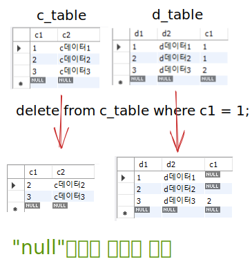

## 서브쿼리 (sub query)

```sql
-- allen 보다 높은 급여를 받는 사원 조회
select sal from emp where ename='allen';
select * from emp where sal > 1600;

-- 서브쿼리 사용
select * from emp where sal > (select sal from emp where ename='allen');

select * from emp where sal > (select ename from emp where ename='allen');
-- "sal"을 기준으로 판단해야 하는데 "ename"이랑 비교 해서 의미없음.
```

### 예제

<details>
<summary>
급여가 가장 적은 사원의 이름 조회
</summary>
<div markdown="1">

```sql
select ename from emp where sal = (select min(sal) from emp);
```

</div>
</details>

### 예제

<details>
<summary>
1. clark 보다 늦게 입사한 사원 조회<br>
2. 부서번호가 20인 사원 중에서 전체 사원 평균 급여보다 높은 급여를 받는 사원 조회<br>
3. 2번 조회 결과에서 부서이름, 부서위치도 함께 조회
</summary>
<div markdown="1">

```sql
-- 1
select * from emp where hiredate > (select hiredate from emp where ename='clark');

-- 2
select * from emp where sal > (select avg(sal) from emp) and deptno=20;

-- 3
select * from emp e, dept d
where e.deptno = d.deptno and e.deptno=20 and e.sal > (select avg(sal) from emp);
-- avg(e.sal) 안됨, 서브쿼리를 쓰면 서브쿼리를 먼저 실행함(약어 설정 전이므로 error)
```

</div>
</details>

## 테이블 만들기

```sql
create table [테이블이름] (
    [컬럼명1] [타입](크기),
    [컬럼명2] int,
    [컬럼명n] [타입](크기),
    constraint [제약조건이름(필수는 아님)] [제약조건종류] (제약조건지정할컬럼명),
    constraint [제약조건이름(필수는 아님)] [제약조건종류] (제약조건지정할컬럼명)
);
```

## 제약조건(constraint) 종류

### primary key(pk, 주키, 유일키)

- 일반적으로 테이블당 하나의 컬럼에 대해 pk로 지정.
- 테이블에 저장된 행들을 구분하는데 사용.
- 조회, 수정 삭제 등을 할 때도 pk컬럼을 조건으로 많이 사용.
- 필수입력(not null), 중복허용하지 않음(unique)
- ex) 게시글번호, 주민번호, 회원번호, 아이디 등

### foreign key(fk, 외래키, 참조키)
- 두 테이블간의 연관관계(relation)가 생성
- 참조하고자 하는 테이블의 pk를 참조함.

### not null

해당 컬럼에 값을 필수로 입력.

### unique

중복값을 허용하지 않음.

## 실습

```sql
create table emp_test(
    empno int,
    ename varchar(20),
    job varchar(20) not null,
    sal int,
    constraint pk_emp_test primary key(empno), -- 제약조건 이름 지정
    constraint unique(ename) -- 제약조건 이름 지정 안함
);

insert into emp_test(empno, ename, job, sal)
	values(1111, 'aaa', 'salesman', 1000);

-- empno에 1111을 또 저장하는 경우 (중복값 에러)
insert into emp_test(empno, ename, job, sal)
	values(1111, 'bbb', 'clerk', 2000);

-- ename에 bbb를 또 저장하는 경우 (중복값 에러)
insert into emp_test(empno, ename, job, sal)
	values(3333, 'bbb', 'developer', 3000);
    
-- job에 값을 넣지 않는 경우 (error)
insert into emp_test(empno, ename, job, sal)
	values(4444, 'ddd', null, 4000);
```

## 제약조건 확인

```sql
select * from information_schema.table_constraints; -- 모든 테이블
select * from information_schema.table_constraints where table_name='emp_test';

-- 테이블을 삭제하면 제약조건도 함께 삭제됨.
drop table emp_test;
```

## 참조관계

```sql
-- a, b 참조관계
-- b테이블의 a1 컬럼은 a테이블의 a1 컬럼을 참조(a: 부모, b: 자식)
create table a_table(
	a1 varchar(10),
    a2 int,
    constraint pk_a_table primary key(a1)
);
create table b_table(
    b1 varchar(10),
    b2 int,
    a1 varchar(10),
    constraint pk_b_table primary key(b1),
    constraint fk_b_table foreign key(a1) references a_table(a1)
);

insert into a_table(a1, a2) values('aaa', 111);
insert into a_table(a1, a2) values('bbb', 222);
insert into b_table(b1, b2, a1) values('b111', 123, 'aaa');
insert into b_table(b1, b2, a1) values('b222', 123, 'ccc');
-- error code 1452 발생
-- 부모 테이블의 a1 컬럼을 참조하고 있으므로 부모 테이블인 a테이블에 이미 존재하는 값만 넣을 수 있음.
-- 참조관계 컬럼 이름을 보통 같게 하지만 달라도 됨.
```

### 예제

<details>
<summary>
emp, dept 테이블을 참조관계를 적용하여 만들어봅시다.<br>
테이블이름: emp1, dept1<br>
emp1: pk(empno), fk(deptno는 dept1 테이블의 deptno 컬럼을 참조)<br>
dept1: pk(deptno)
</summary>
<div markdown="1">

```sql
create table emp1(
	empno int,
    deptno int,
    constraint pk_emp1_table primary key(empno),
    constraint fk_emp1_table foreign key(deptno) references dept1(deptno)
);
create table dept1(
	deptno int,
	constraint pk_dept1_table primary key(deptno)
);
```

</div>
</details>

### 참조관계가 있는 테이블을 지우려 할 때,

```sql
create table c_table(
	c1 int,
    c2 varchar(20),
    constraint pk_c_table primary key(c1)
);
create table d_table(
	d1 int,
    d2 varchar(20),
    c1 int,
    constraint pk_d_table primary key(d1),
    constraint fk_d_table foreign key(c1) references c_table(c1)
);

insert into c_table(c1, c2) value(1, 'c데이터1');
insert into c_table(c1, c2) value(2, 'c데이터2');
insert into c_table(c1, c2) value(3, 'c데이터3');

insert into d_table(d1, d2, c1) value(1, 'd데이터1', 1);
insert into d_table(d1, d2, c1) value(2, 'd데이터2', 1);
insert into d_table(d1, d2, c1) value(3, 'd데이터3', 2);

drop table c_table;
```

>error: "c_table"은 "d_table"로 부터 "c1"컬럼을 참조 받고 있으므로, "d_table"을 먼저 지워서 참조관계를 끊어야 drop이 가능하다.

## 데이터 삭제

```sql
delete from c_table where c1 = 1;
```

>자식테이블(d_table)에서 c1이 1인 데이터를 참조하고 있기 때문에 부모의 c1에 있는 1을 삭제하는 것이 불가능.

```sql
delete from d_table where c1 = 1;
```

>"d_table"에서 c1을 삭제 하는 건 문제 없음

```sql
delete from c_table where c1 = 3;
```

> 참조하는게 없기 때문에 "3"은 삭제 됨

### on delete cascade 적용한 상태에서 c1=1 삭제

```sql
create table d_table(
	d1 int,
    d2 varchar(20),
    c1 int,
    constraint pk_d_table primary key(d1),
    constraint fk_d_table foreign key(c1) references c_table(c1) on delete cascade
);

delete from c_table where c1 = 1;
select * from c_table; -- c1 삭제됨
select * from d_table; -- c1 삭제됨
```

## on delete set null

```sql
create table d_table(
	d1 int,
    d2 varchar(20),
    c1 int,
    constraint pk_d_table primary key(d1),
    constraint fk_d_table foreign key(c1) references c_table(c1) on delete set null
);

delete from c_table where c1 = 1;
select * from c_table; -- c1 지워짐
select * from d_table; -- 참조한 부분은 null이 됨
```

> 커뮤니티에서 "on delete cascade"에서 계정 탈퇴하면 게시글이 지워지지만\
"on delete set null"에서는 게시글은 남아 있지만 작성자는 알 수 없거나 흔적만 남음\


## now()

```sql
create table board_table(
	b_id bigint,
    b_writer varchar(20),
    b_title varchar(50),
    b_create_date datetime,
    b_update_date datetime on update current_timestamp, -- "on update": 업데이트 수행 시, "current_timestamp": 현재 시각을 찍어줌
    constraint pk_board_table primary key(b_id)
);
insert into board_table(b_id, b_writer, b_title, b_create_date)
	values(1, '작성자1', '제목1', now());
select * from board_table; -- 구매 일자, 글 작성 일자, 가입 일자, 회원정보 최종수정 일자....

-- 수정쿼리
update board_table set b_title='수정제목1' where b_id=1; -- where절에 보통 pk가 옴, 특정 글 수정, 삭제 등...
```
