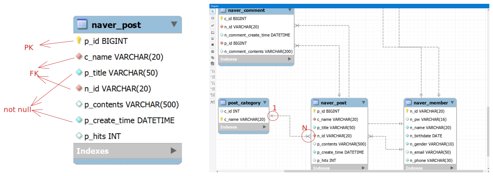

**역설계: 결과물을 보고 거꾸로 만드는거(클론코딩)**

**객체지향프로그래밍: 대상이 어떤 속성값을 가지고 있는지, 대상이 가지고 있는 요소를 DB에서는 컬럼, 자바에서는 변수로**

**브라우저에서 클릭하는 행위가 서버에 보내는 요청(request), 서버는 주소에 맞는 화면을 respond(백엔드가 함)**

## ERD(Entity Relationship Diagram) 살펴보기

객체 관계도/
NTT, 테이블

- 각 컬럼의 아이콘 의미
- 테이블간의 연결선(식별-비식별)
    - 식별(실선): 부모의 pk를 자식도 pk로 사용
    - 비식별(점선): 부모의 pk를 자식은 fk로 사용
- 1:1, 1:N, N:N 



## 게시판 관련 기능

<details>
<summary>
예제 테이블
</summary>
<div markdown="1">

```sql
drop table naver_member;
create table naver_member(
	n_id varchar(20),
    n_pw varchar (16) not null,
    n_name varchar(20) not null,
    n_birthdate date not null,
    n_gender varchar(10) not null,
    n_email varchar(50),
    n_phone varchar(30) not null,
    constraint pk_naver_member primary key(n_id)
);

drop table naver_post;
create table naver_post (
	p_id bigint auto_increment,
    c_name varchar(20) not null,
    p_title varchar(50) not null,
    n_id varchar(20) not null,
    p_contents varchar(500),
    p_create_time datetime not null,
    p_hits int default 0,
    constraint pk_naver_post primary key(p_id),
    constraint fk_naver_post foreign key(n_id) references naver_member(n_id),
    constraint fk_naver_post_category foreign key(c_name) references post_category(c_name)
);

drop table post_category;
create table post_category(
	c_id int,
    c_name varchar(20),
    constraint pk_post_category primary key(c_name)
);

drop table naver_comment;
create table naver_comment (
	c_id bigint auto_increment,
	n_id varchar(20) not null,
    n_comment_create_time datetime,
    p_id bigint not null,
	n_comment_contents varchar(200),
    constraint pk_post_comment primary key(c_id),
    constraint fk_naver_comment_writer foreign key(n_id) references naver_member(n_id),
    constraint fk_naver_comment_post foreign key(p_id) references naver_post(p_id)
);

insert into naver_member(n_id, n_pw, n_name, n_birthdate, n_gender, n_email, n_phone) 
value('id1', 1234, '김아디', '1988-01-13', '남자', 'ked@gmail.com', '010-1232-5245');
insert into naver_member(n_id, n_pw, n_name, n_birthdate, n_gender, n_email, n_phone) 
value('id2', 2323, '이아디', '1990-08-01', '여자', 'lee@gmail.com', '010-2244-1111');
insert into naver_member(n_id, n_pw, n_name, n_birthdate, n_gender, n_email, n_phone) 
value('id3', 5555, '박아디', '2000-04-13', '남자', 'park@gmail.com', '010-6666-1232');
```

</div>
</details>

### 1.카테고리는 가입인사, 공지사항 두가지가 있음.

```sql
insert into post_category(c_id, c_name)
	values(1, '가입인사');
insert into post_category(c_id, c_name)
	values(2, '공지사항');
```

### 2.id1 회원이 가입인사, 공지사항 게시판에 글을 각각 하나씩 작성함.

```sql
insert into naver_post(c_name, p_title, n_id, p_contents, p_create_time)
	values('가입인사', 'id1의 가입인사', 'id1', '제곧내', now());
insert into naver_post(c_name, p_title, n_id, p_contents, p_create_time)
	values('공지사항', 'id1의 공지사항', 'id1', '제곧내', now());
```

### 3.id3 회원이 가입인사, 공지사항 게시판에 글을 각각 하나씩 작성함.

```sql
insert into naver_post(c_name, p_title, n_id, p_contents, p_create_time)
	values('가입인사', 'id3의 가입인사', 'id3', '냉무', now());
insert into naver_post(c_name, p_title, n_id, p_contents, p_create_time)
	values('공지사항', 'id3의 공지사항', 'id3', '냉무', now());
```

### 4.글번호가 3인 글을 조회함.(4~6번 조회 처리는 조회수를 하나 올리는 쿼리를 수행하고, 해당 글만 보여주는 쿼리를 수행해야 함.(2가지 쿼리가 필요))

```sql
update naver_post set p_hits = p_hits + 1 where p_id='3';
select * from naver_post where p_id='3';
```

### 5.글번호가 2인 글을 조회함.

```sql
update naver_post set p_hits = p_hits + 1 where p_id='2';
select * from naver_post where p_id='2';
```

### 6.글번호가 2인 글을 조회함.

```sql
update naver_post set p_hits = p_hits + 1 where p_id='2';
select * from naver_post where p_id='2';
```

### 7.전체 게시글을 조회수가 높은 글 순으로 출력함. 

```sql
select * from naver_post order by p_hits desc;
```


### 8.전체 게시글을 가장 먼저 작성한 글 순으로 출력함. 

```sql
select * from naver_post order by p_create_time asc;
```

### 9.공지사항 게시글을 가장 최근에 작성한 글 순으로 출력함. 

```sql
select * from naver_post where c_name='공지사항' order by p_create_time desc;
```

### 10.id1 회원이 작성한 가입인사 게시글 제목을 수정함. 

```sql
update naver_post set p_title = '수정한 제목' where p_id='2';
```

### 11.id3 회원이 작성한 공지사항 게시글을 삭제함. 

```sql
delete from naver_post where p_id='5';
```

### 12.제목에 '안녕' 이라는 단어가 포함된 게시글 검색 결과를 최근순으로 출력. 

```sql
insert into naver_post(c_name, p_title, n_id, p_contents, p_create_time)
	values('가입인사', '이건 가입인사 안녕', 'id1', '냉무', now());
select * from naver_post where p_title like '%안녕%' order by p_create_time desc;
```

### 13.id1이 작성한 게시글만 조회

```sql
select * from naver_post where n_id='id1';
```

## 댓글 관련 기능 

### 1.id3 회원이 id1 회원이 작성한 공지사항에 댓글을 작성함. 

```sql
insert into naver_comment(n_id, n_comment_create_time, p_id, n_comment_contents) 
value('id3', now(), 3, 'id3이 id1의 글에 작성한 댓글');
```

### 2.id1 회원이 id3 회원이 작성한 가입인사 게시글에 댓글을 작성함. 

```sql
insert into naver_comment(n_id, n_comment_create_time, p_id, n_comment_contents) 
value('id1', now(), 4, 'id1이 id3의 글에 작성한 댓글');
```

### 3.id4라는 회원을 신규가입함. 

```sql
insert into naver_member(n_id, n_pw, n_name, n_birthdate, n_gender, n_email, n_phone) 
value('id4', 1234, '사아디', '1999-02-11', '남자', 'dfijejf@gmail.com', '010-5566-1232');
```
### 4.id4 회원이 id1 회원이 작성한 공지사항에 댓글을 작성함. 

```sql
insert into naver_comment(n_id, n_comment_create_time, p_id, n_comment_contents) 
value('id4', now(), 3, 'id4이 id1의 공지사항에 작성한 댓글');
```

### 5.id1 회원이 작성한 공지사항의 댓글 목록을 출력함. 

```sql
select * from naver_post where p_id='3'; -- 실제 게시글과 댓글이 같이 보여야 하므로 두 쿼리를 가져가야 함.
select * from naver_comment where p_id='3';
select count(c_id) from naver_comment where p_id=4; -- 댓글 갯수
```

### 6.id3 회원이 작성한 가입인사 게시글의 댓글 목록을 출력함. 

```sql
select * from naver_comment where p_id='4';
```
