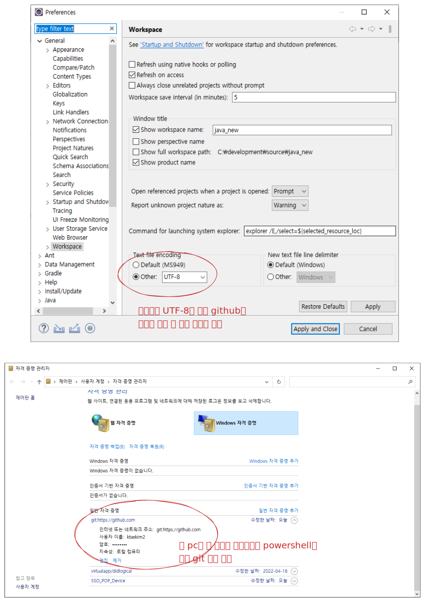

## git

- 형상관리(Configuration Management) 도구
    - 초기 설계부터 개발 완료까지 버전 관리
- 버전관리: 00.00.00
- git으로 관리할 폴더에서 power shell 열기
- 해당 폴더를 git으로 관리
    - git init

### 사용자정보 입력

- git config --global user.name '본인username'
- git config --global user.email '본인email'
- git config --global --list: 확인

### 로컬과 github 연동

- git remote add origin '본인git repository 주소'
    - github에서 repository 처음 만들면 보이는거 복붙하는게 좋음
- git config --local --list
    - remote.origin.url='설정한 주소' 맞는지 확인

### 업로드 할 파일 지정

- 어떤 파일을 올릴지 확인
    - git status
- 현재 폴더의 전체 파일 올리기
    - git add .(stage에 올린다 라고 표현)

### 커밋하기

- commit을 한번 한다는 것은 하나의 버전이 생긴다는 개념
- commit 메세지를 같이 써서 어떤 변경이 있었는지 기록
- commit만 하면 github에 올라가는 것은 아님
- git commit -m '커밋 메세지'

### push

- commit한 내용을 github에 업로드
- git push -u origin main



<details>
<summary>
예제 테이블
</summary>
<div markdown="1">

```sql
drop table book;
select * from book;
create table book (
	b_id int auto_increment,
    b_bookname varchar(40),
    b_publisher varchar(40),
    b_price int,
    constraint pk_book primary key(b_id)
);
insert into book(b_bookname, b_publisher, b_price) value('축구의 역사', '굿스포츠', 7000);
insert into book(b_bookname, b_publisher, b_price) value('축구스카우팅 리포트', '나무수', 13000);
insert into book(b_bookname, b_publisher, b_price) value('축구의 이해', '대한미디어', 22000);
insert into book(b_bookname, b_publisher, b_price) value('배구 바이블', '대한미디어', 35000);
insert into book(b_bookname, b_publisher, b_price) value('피겨 교본', '굿스포츠', 8000);
insert into book(b_bookname, b_publisher, b_price) value('피팅 단계별기술', '굿스포츠', 6000);
insert into book(b_bookname, b_publisher, b_price) value('야구의 추억', '이상미디어', 20000);
insert into book(b_bookname, b_publisher, b_price) value('야구를 부탁해', '이상미디어', 13000);
insert into book(b_bookname, b_publisher, b_price) value('올림픽 이야기', '삼성당', 7500);
insert into book(b_bookname, b_publisher, b_price) value('olympic champions', 'pearson', 13000);

drop table customer;
select * from customer;
create table customer (
	c_id int auto_increment,
    c_name varchar(40),
    c_address varchar(50),
    c_phone varchar(20),
    constraint pk_customer primary key(c_id)
);
insert into customer(c_name, c_address, c_phone) value('손흥민', '영국 런던', '000-5000-0001');
insert into customer(c_name, c_address, c_phone) value('김연아', '대한민국 서울', '000-6000-0001');
insert into customer(c_name, c_address, c_phone) value('김연경', '중국 상하이', '000-7000-0001');
insert into customer(c_name, c_address, c_phone) value('류현진', '캐나다 토론토', '000-8000-0001');
insert into customer(c_name, c_address, c_phone) value('이강인', '스페인 마요르카', null);

drop table orders;
select * from orders;
create table orders (
	o_id int auto_increment,
    c_id int,
    b_id int,
    o_saleprice int,
	o_orderdate date,
    constraint pk_orders primary key(o_id),
    constraint fk_orders_customer foreign key(c_id) references customer(c_id),
    constraint fk_orders_book foreign key(b_id) references book(b_id)
);
insert into orders(c_id, b_id, o_saleprice, o_orderdate) value(1, 1, 6000, '2021-07-01');
insert into orders(c_id, b_id, o_saleprice, o_orderdate) value(1, 3, 21000, '2021-07-03');
insert into orders(c_id, b_id, o_saleprice, o_orderdate) value(2, 5, 8000, '2021-07-03');
insert into orders(c_id, b_id, o_saleprice, o_orderdate) value(3, 6, 6000, '2021-07-04');
insert into orders(c_id, b_id, o_saleprice, o_orderdate) value(4, 7, 20000, '2021-07-05');
insert into orders(c_id, b_id, o_saleprice, o_orderdate) value(1, 2, 12000, '2021-07-07');
insert into orders(c_id, b_id, o_saleprice, o_orderdate) value(4, 8, 13000, '2021-07-07');
insert into orders(c_id, b_id, o_saleprice, o_orderdate) value(3, 10, 12000, '2021-07-08');
insert into orders(c_id, b_id, o_saleprice, o_orderdate) value(2, 10, 7000, '2021-07-09');
insert into orders(c_id, b_id, o_saleprice, o_orderdate) value(3, 8, 13000, '2021-07-10');
```
</div>
</details>

### 1. 모든 도서의 가격과 도서명 조회 

```sql
select b_bookname, b_price from book;
```

### 2. 모든 출판사 이름 조회 

```sql
select b_publisher from book;
```

### 2.1 중복값을 제외한 출판사 이름 조회 

```sql
select distinct b_publisher from book;
```

### 3. BOOK테이블의 모든 내용 조회 

```sql
select * from book;
```

### 4. 20000원 미만의 도서만 조회 

```sql
select * from book where b_price < 20000;
```

### 5. 10000원 이상 20000원 이하인 도서만 조회

```sql
select * from book where b_price <= 20000 and b_price >= 10000;
```

### 6. 출판사가 굿스포츠 또는 대한미디어인 도서 조회 

```sql
select * from book where b_publisher = '굿스포츠' or b_publisher = '대한미디어';
```

### 7. 도서명에 축구가 포함된 모든 도서를 조회

```sql
select * from book where b_bookname like '%축구%';
```

### 8. 도서명의 두번째 글자가 구인 도서 조회

```sql
select * from book where b_bookname like '_구%';
```

### 9. 축구 관련 도서 중 가격이 20000원 이상인 도서 조회

```sql
select * from book where b_bookname like '%축구%' having b_price >= 20000;
```

### 10. 책 이름순으로 전체 도서 조회

```sql
select * from book order by b_bookname asc;
```

### 11. 도서를 가격이 낮은 것 부터 조회하고 같은 가격일 경우 도서명을 가나다 순으로 조회

```sql
select * from book order by b_price asc , b_bookname asc;
```

### 12. 주문 도서의 총 판매액 조회 


```sql
select o_saleprice from orders;
```

### 13. 1번 고객이 주문한 도서 총 판매액 조회 

```sql
select o_saleprice from orders where c_id='1';
```

### 14. ORDERS 테이블로 부터 평균판매가, 최고판매가, 최저판매가 조회 

```sql
select avg(o_saleprice), max(o_saleprice), min(o_saleprice) from orders;
```

### 15. 고객별로 주문한 도서의 총 수량과 총 판매액 조회 (GROUP BY 활용)

```sql
select c_id, count(o_id), sum(o_saleprice) from orders group by c_id;
```


### 16. 가격이 8,000원 이상인 도서를 구매한 고객에 대해 고객별 주문 도서의 총 수량 조회 (GROUP BY 활용)
    (단, 8,000원 이상 도서 두 권 이상 구매한 고객만) 

```sql
select c_id, count(o_id) from orders where o_saleprice >= 8000 group by c_id having count(c_id) >= 2;
```

### 17. 김연아고객(고객번호 : 2) 총 구매액

```sql
select sum(o_saleprice) from orders where c_id='2';
```

### 18. 김연아 고객이 구매한 도서의 수

```sql
select count(o_saleprice) from orders where c_id='2';
```

### 19. 서점에 있는 도서의 총 권수

```sql
select count(b_id) from book;
```

### 20. 출판사의 총 수 

```sql
select count(distinct b_publisher) from book;
```

### 21. 7월 4일 ~ 7일 사이에 주문한 도서의 주문번호 조회 

```sql
select o_id from orders where o_orderdate >= '2021-07-04' and o_orderdate <= '2021-07-07';
```

### 22. 7월 4일 ~ 7일 사이에 주문하지 않은 도서의 주문번호 조회 

```sql
select o_id from orders where not o_orderdate >= '2021-07-04' or not o_orderdate <= '2021-07-07';
```
