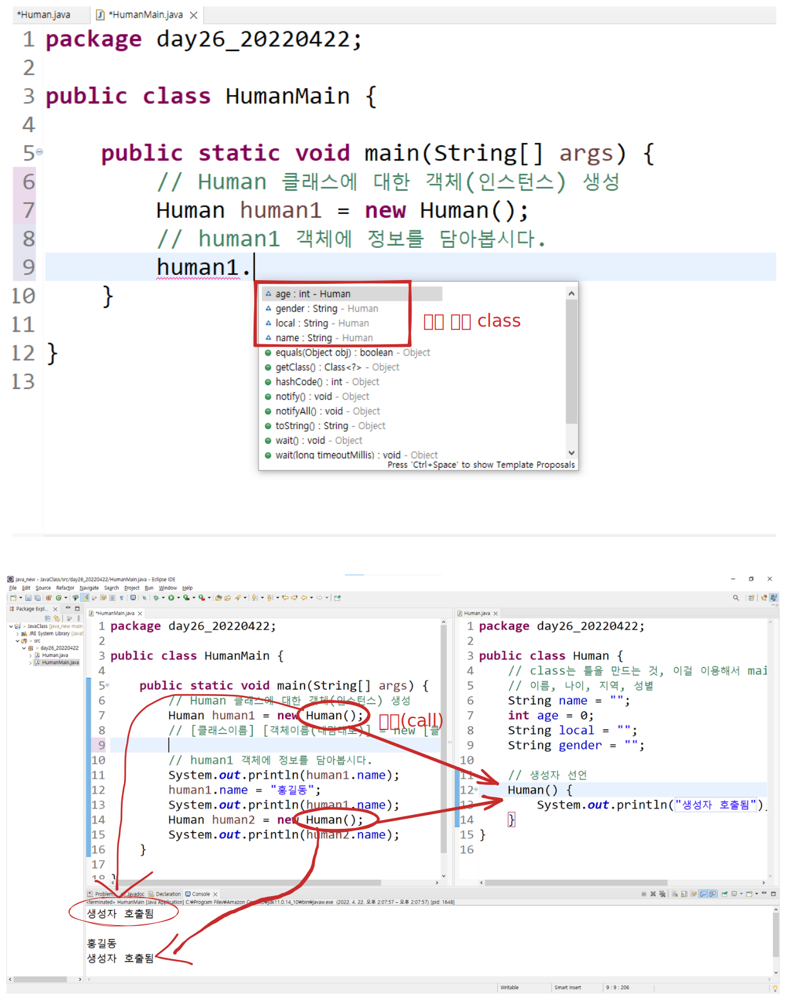
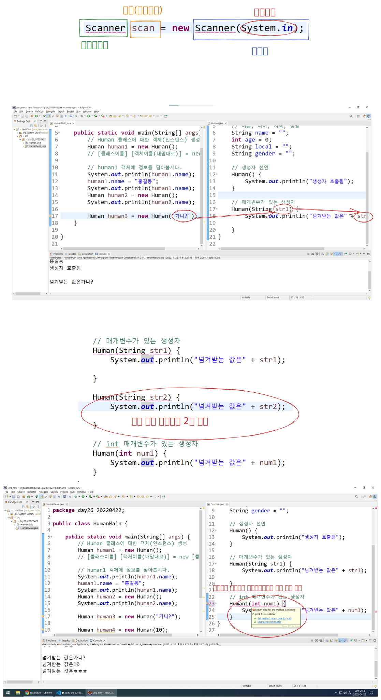
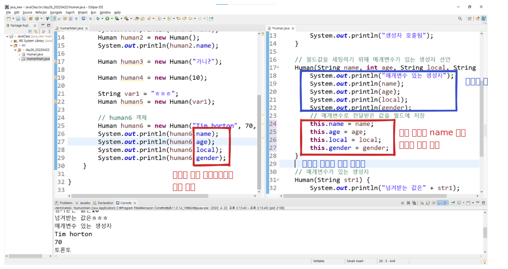

## 객체지향 프로그래밍(OOP, Object Oriented Programming)

- 언어(Language): Java, javascript, typescript python, c#, c++, kotlin
- 프레임워크(Framework): spring, spring boot
- 절차지향 프로그래밍: 하나의 메서드 안에서 해결
- 객체지향 프로그래밍: 하나 이상의 외부 메서드를 사용
- java class를 가지고 이 세상 모든 것을 표현하자
    - class: 표현하고자 하는 대상(사람, 학생, 물건 등)
    - field: 그 대상이 가지고 있는 속성(사람이라면 이름, 나이, 성별, 전화번호 등)

## 클래스의 요소

- field
- constructor(생성자)
    - 이 클래스를 객체로 만들 때 따라야 하는 규칙
    - 반드시 클래스 이름과 동일해야 함(그래야 인식 함 다른 이름으로 하면 메서드로 인식할 수도 있음)
    - 생성자를 아무것도 쓰지 않을 경우 기본 생성자가 있음.
        - 기본생성자: 클래스이름()
- method



## 매개변수(parameter)

- 생성자 또는 메서드를 호출할 때 넘겨주는 데이터
- 특정 형태의 생성자를 만들면 기본 생성자는 없어짐



- 보통 매개변수 이름 = 필드 이름
- 필드 앞에 this.(보통 생성자에서 씀)
- 필드 값을 생성하는건 생성자 역할의 옵션이고 객체를 만드는게 필수역할



## Human class

```java
public class Human {
	// class는 틀을 만드는 것, 이걸 이용해서 main class에서 객체를 만듬.
	// 이름, 나이, 지역, 성별
	String name = "";
	int age = 0;
	String local = "";
	String gender = "";

	// (매개변수가 없는)기본 생성자 선언
	Human() {
		System.out.println("생성자 호출됨");
	}
	
	// 필드값을 세팅하기 위해 매개변수가 있는 생성자 선언
	Human(String name, int age, String local, String gender) {
		System.out.println("매개변수 있는 생성자");
		System.out.println(name);
		System.out.println(age);
		System.out.println(local);
		System.out.println(gender);
		// 매개변수로 전달받은 값을 필드에 저장
		this.name = name;
		this.age = age;
		this.local = local;
		this.gender = gender;
	}
	
	// 매개변수가 있는 생성자
	Human(String str1) {
		System.out.println("넘겨받는 값은" + str1);
		
	}	
	
	// int 매개변수가 있는 생성자
	Human(int num1) {
		System.out.println("넘겨받는 값은" + num1);
	}
}
```

## Human main

```java
public class HumanMain {

	public static void main(String[] args) {
		// Human 클래스에 대한 객체(인스턴스) 생성
		Human human1 = new Human();
		// [클래스이름] [객체이름(내맘대로)] = new [클래스 생성자]

		// human1 객체에 정보를 담아봅시다.
		System.out.println(human1.name);
		human1.name = "홍길동";
		System.out.println(human1.name);
		Human human2 = new Human();
		System.out.println(human2.name);
		
		Human human3 = new Human("가니?");
		
		Human human4 = new Human(10);
		
		String var1 = "ㅎㅎㅎ";
		Human human5 = new Human(var1);
		
		// human6 객체
		Human human6 = new Human("Tim horton", 70, "토론토", "남성");
		System.out.println(human6.name);
		System.out.println(human6.age);
		System.out.println(human6.local);
		System.out.println(human6.gender);
	}

}
```

## Student class

```java
public class Student {
	String name;
	String major;
	String studentNumber; // 앞자리 0일수도 있어서
	int age;

    Student() {
    
}

// 필드값 출력을 위한 메서드
void studentPrint() {
    System.out.println(this.name);
    System.out.println(this.major);
    System.out.println(this.studentNumber);
    System.out.println(this.age);
}
```
void: return할게 없다. 있다면 리턴하고자 하는 date type이 옴

## Student main

```java
public class StudentMain {

	public static void main(String[] args) {
		Student student1 = new Student();
//		System.out.println(student1.name);
//		System.out.println(student1.major);
//		System.out.println(student1.studentNumber);
//		System.out.println(student1.age);
		student1.name = "김이름";
		student1.major = "메이전공";
		student1.studentNumber = "9999";
		student1.age = 99;
		student1.studentPrint();
```
